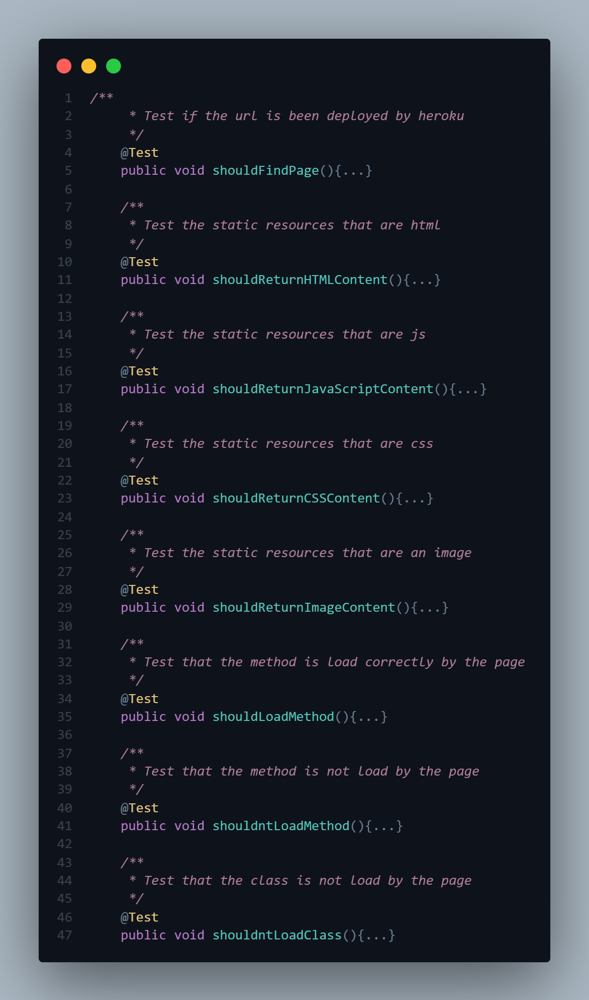

# TALLER DE ARQUITECTURAS DE SERVIDORES DE APLICACIONES, META PROTOCOLOS DE OBJETOS, PATRÓN IOC, REFLEXIÓN
Para este taller se construyó un servidor Web (tipo Apache) en Java. El servidor es capaz de entregar páginas html e imágenes tipo PNG. Igualmente el servidor provee un framework IoC para la construcción de aplicaciones web a partir de POJOS.
## Comenzando 🚀

A continuación se presentarán series de instrucciones para que se pueda tener un funcionamiento en maquina local del proyecto


### Pre-requisitos 📋

Para el correcto funcionamiento en un ambiente de desarrollo se deberán tener instaladas las siguientes tecnologías:  
* [Git](https://git-scm.com/) - Software de control de versiones
* [Java 8](https://www.java.com/es/download/ie_manual.jsp) - Entorno de desarrollo
* [Maven](https://maven.apache.org/) - Manejador de dependencias

### Instalación 🔧

1. **Clonar el proyecto**
    ```
    git clone https://github.com/AngieMeG/AREP-T03
    ```
2. **Compilar el proyecto**
    ```
    mvn package
    ```
3. **Ejecutar la aplicación**  
    * Para entornos Windows
        ```
        java -cp "target/classes;target/dependency/*" edu.escuelaing.arep.networking.httpserver.HttpServer
        ``` 
    * Para entornos Unix
        ```
        java $JAVA_OPTS -cp target/classes:target/dependency/* edu.escuelaing.arep.networking.httpserver.HttpServer
        ```
4. **Servicio Web**  
Para observar la pagina web se debera escribir la siguiente URL en el browser de preferencia
    ```
    http://localhost:35000
    ```
## Ejecutando las pruebas ⚙️

Para la ejecución de las pruebas
```
mvn test
```



## Informe de Arquitectura 🔨 
La información sobre la arquitectura se encuentra en el siguiente [paper](Arep_T02.pdf)

## Ejecución
Se ha construido un sitio web con javascript para probar el servidor.
Se pueden hacer consultas escribiendo en el espacio provisto por el servidor o simplemente agregando *"/nombre y extension del recurso"*
* Al ingresar a la URL lo primero que nos encontraremos sera

* El mismo input muestra algunas de las opciones a probar

* Si se quiere ingresar por ejemplo a un recurso estatico HTML

* Como se puede observar este recurso cuenta con su propia hoja de estilos y css, por lo que si le damos click en el boton

* Para el ejemplo del recurso JavaScript

* El archivo css

* Alguna imagen

* Y por ultimo si se quiere consultar un recurso estatico no disponible


## Despliegue 📦
[](https://http-server-arep.herokuapp.com/)
El despliegue de la aplicación se encuentra en [HTTP-SERVER](https://http-server-arep.herokuapp.com/)

## Construido con 🛠️

* [Maven](https://maven.apache.org/) - Manejador de dependencias
* [JQuery](https://jquery.com/) - Libreria JavaScript para el manejo del DOM
* [JUnit](https://junit.org/junit5/) - Herramienta para pruebas unitarias en Java

## Documentación 📖
Para generar la documentación
```
mvn javadoc:javadoc
```

Haga click [AQUI](./Documentacion/apidocs/index.html) para ver la documentación

## Autores ✒️

* **Angie Tatiana Medina Gil**

## Licencia 📄

Este proyecto está bajo la Licencia GNU General Public License mire el archivo [LICENSE.md](LICENSE.md) para detalles
