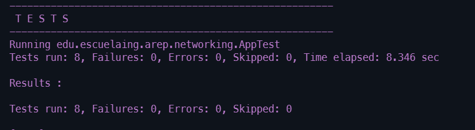

# TALLER DE ARQUITECTURAS DE SERVIDORES DE APLICACIONES, META PROTOCOLOS DE OBJETOS, PATRÓN IOC, REFLEXIÓN
Para este taller se construyó un servidor Web (tipo Apache) en Java. El servidor es capaz de entregar páginas html e imágenes tipo PNG. Igualmente el servidor provee un framework IoC para la construcción de aplicaciones web a partir de POJOS.
## Comenzando 🚀

A continuación se presentarán series de instrucciones para que se pueda tener un funcionamiento en maquina local del proyecto


### Pre-requisitos 📋

Para el correcto funcionamiento en un ambiente de desarrollo se deberán tener instaladas las siguientes tecnologías:  
* [Git](https://git-scm.com/) - Software de control de versiones
* [Java 8](https://www.java.com/es/download/ie_manual.jsp) - Entorno de desarrollo
* [Maven](https://maven.apache.org/) - Manejador de dependencias

### Instalación 🔧

1. **Clonar el proyecto**
    ```
    git clone https://github.com/AngieMeG/AREP-T03
    ```
2. **Compilar el proyecto**
    ```
    mvn package
    ```
3. **Ejecutar la aplicación**  
    * Para entornos Windows
        ```
        java -cp "target/classes;target/dependency/*" edu.escuelaing.arep.networking.webapp.AppStarter
        ``` 
    * Para entornos Unix
        ```
        java $JAVA_OPTS -cp target/classes:target/dependency/* edu.escuelaing.arep.networking.webapp.AppStarter
        ```
4. **Servicio Web**  
Para observar la pagina web se debera escribir la siguiente URL en el browser de preferencia
    ```
    http://localhost:35000
    ```
Adicional, la parte del framework se accesa como:
    ```
    http://localhost:35000/appuser/
    ```
Y se adiciona el componente al que se quiere acceder seguido del metodo a correr, un ejemplo es:
    ```
    http://localhost:35000/appuser/Math/cubo
    ```
## Ejecutando las pruebas ⚙️

Para la ejecución de las pruebas
```
mvn test
```




## Extensibilidad 📁
Para poder agregar clases y metodos de manera que sean visibles para el framework se debera para cada uno:  
* Clases: Se deberá crear la clase en la carpeta webapp con la anotación *Component*
* Metodos: Se deberá crear el metodo en una clase con las condiciones descritas arriba, con la anotación *Service("/")* junto con el nombre que se quiere utilizar para acceder al metodo desde la URL. Adicional este metodo debera ser estatico

Para ejemplificar lo antes dicho, un ejemplo seria:  

    
    package edu.escuelaing.arep.networking.webapp;
    @Component
    public class Name {
        @Service("/something")
        public static String methodName(){
            return "Something";
        }
    }
    

## Informe de Arquitectura 🔨 
La información sobre la arquitectura se encuentra en el siguiente [paper](Arep_T03.pdf)

## Ejecución
Para información sobre la primera parte de los requerimientos (el servidor web que sea responsivo a solicitudes html e imagenes) dirijase al siguiente [repositorio](https://github.com/AngieMeG/AREP-T02).  

Para probar la implementacion del framework se le agrega a la URL base *http://localhost:35000/* o *https://arep-framework.herokuapp.com/* appuser junto con el nombre de la clase y el metodo que se quiere ejecutar separados por el caracter especial */*. Ejemplificando quedaria algo asi:
```
https://arep-framework.herokuapp.com/appuser/Math/cubo
```


## Despliegue 📦
[](https://arep-framework.herokuapp.com/)
El despliegue de la aplicación se encuentra en [Spring-Framework](https://arep-framework.herokuapp.com/)

## Construido con 🛠️

* [Maven](https://maven.apache.org/) - Manejador de dependencias
* [JQuery](https://jquery.com/) - Libreria JavaScript para el manejo del DOM
* [JUnit](https://junit.org/junit5/) - Herramienta para pruebas unitarias en Java

## Documentación 📖
Para generar la documentación
```
mvn javadoc:javadoc
```

Haga click [AQUI](./Documentacion/apidocs/index.html) para ver la documentación

## Autores ✒️

* **Angie Tatiana Medina Gil**

## Licencia 📄

Este proyecto está bajo la Licencia GNU General Public License mire el archivo [LICENSE.md](LICENSE.md) para detalles
